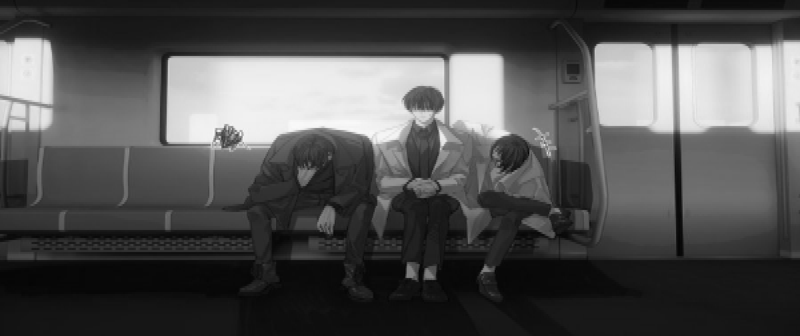
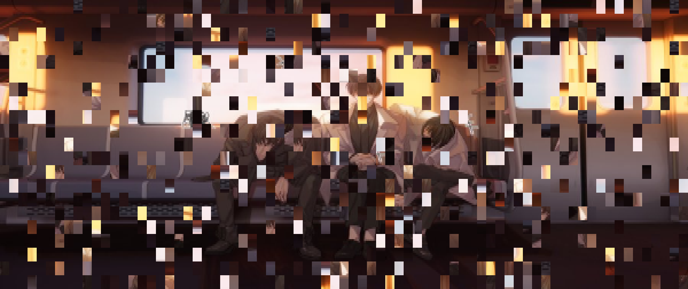
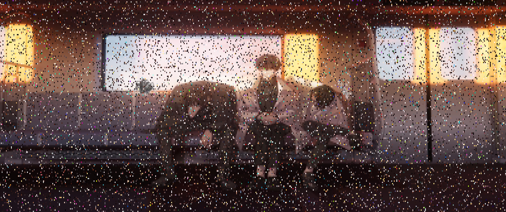
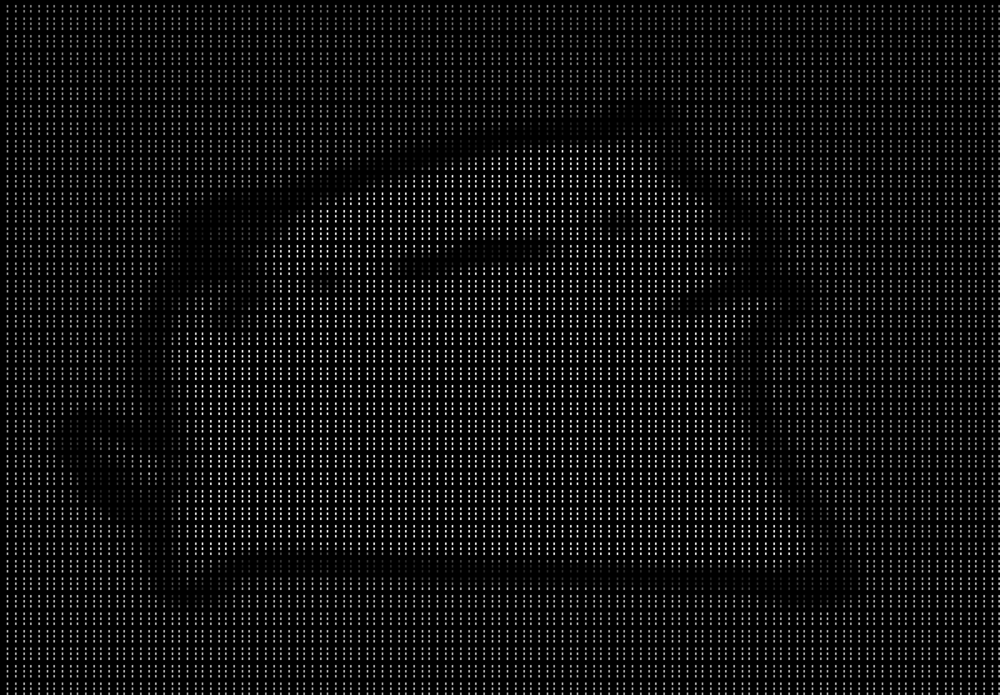
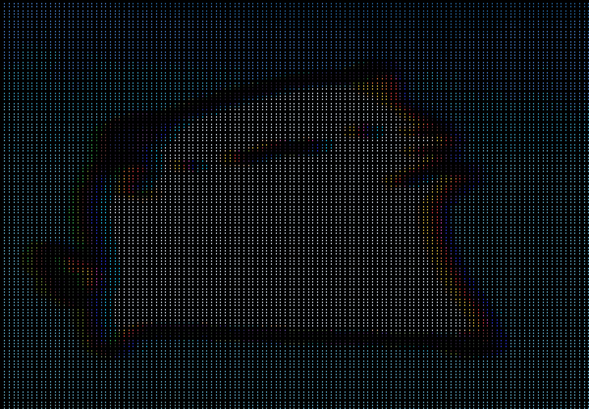

# Glyphweave

**Glyphweave** is a command‑line tool that transforms images (static or animated GIFs) into beautiful ASCII art with true‑colour support and a rich set of real‑time glitch effects.  
It combines high‑quality Floyd‑Steinberg or Bayer dithering with a fully configurable glitch pipeline – perfect for terminal art, creative coding, or just having fun.

**Glyphweave** is just a fun and cool name

---

## Note

Im too lazy to make a readme, so this is made by llm, dont ask me if something is off abt this

theres also a secret option for the glitch find it and try it out

---

## Features

- **Image input** – supports PNG, JPEG, GIF (animated) via stb_image.
- **ASCII rendering** – user‑selectable character ramp (default: ` ▁▂▃▄▅▆▇█`).
- **Dithering** – choose between fast Bayer (ordered) or high‑quality Floyd‑Steinberg error diffusion.
- **Colour support** – 24‑bit ANSI true colour in the terminal; PNG/GIF export preserves colours.
- **Glitch effects** – 7 distinct effects that can be enabled individually or randomly.
- **Export** – save as plain text (`.txt`), PNG, or animated GIF.
- **Live preview** – loop static or animated images in the console with glitch effects (Ctrl+C to exit).
- **Cross‑platform** – works on Windows (native console API) and Unix‑like systems.

---

## Building

### Dependencies

- C++17 compiler (MSVC, GCC, Clang) (I made this with MSVC)
- [stb_image](https://github.com/nothings/stb) (included via `#define`)
- [stb_image_write](https://github.com/nothings/stb)
- [gif.h](https://github.com/charlietangora/gif-h) (single‑header GIF writer)
- Ninja
- CMake

### CMake

```bash
git clone https://github.com/ZackDelsnova/glyphweave.git
cd glyphweave
# use either release or debug, release is faster
# release
cmake -S . -B build -G Ninja -DCMAKE_BUILD_TYPE=Release
# debug
cmake -S . -B build -G Ninja -DCMAKE_BUILD_TYPE=Debug
cmake --build build
```

### Usage

```bash
glyphweave <filename> [options]
```

### Examples

- static image in terminal, monochrome

```bash
glyphweave image.jpg
```

- static image in terminal, color

```bash
glyphweave image.jpg -c
```

- use Bayer matrix instead, default Floyd-Steinberg

```bash
glyphweave image.jpg --fast
```

- save as png

```bash
glyphweave image.jpg --png output.png -c
```

- static image with glitch effects and save as GIF

```bash
glyphweave image.jpg --glitch row_shift,rgb_shift --gif glitch.gif -c
```

### Glitch effects

Enable one or more effects with the --glitch option, using a comma‑separated list. Each effect can take parameters (see table)

| Effect | Parameters | Default Values | Description |
| :--- | :--- | :--- | :--- |
| **row_shift** | `intensity` | `8` | Random row shifts (CRT jitter) |
| **dropout** | `rate` | `0.05` | Randomly drop cells to create space |
| **sine_warp** | `amplitude`, `frequency` | `2.0`, `0.1` | Wavy horizontal displacement |
| **rgb_shift** | `amount` | `2` | Separate RGB channels (3D effect) |
| **jpeg_smash** | `block_size`, `intensity` | `8`, `0.3` | Replace blocks randomly (JPEG artefact) |
| **data_bend** | `chance` | `0.1` | Bit‑level corruption or cell swaps |
| **mirror_slice** | `width`, `vertical` | `10`, `true` | Flip strips horizontally/vertically |

### Output options

| Option | Description |
| :--- | :--- |
| `-c`, `--color` | Enable ANSI true colour (console/PNG/GIF) |
| `--fast` | Use Bayer dithering instead of Floyd‑Steinberg |
| `--width <n>` | Target width (`0` = auto‑detect terminal width) |
| `--interval <ms>` | Delay between frames for live animation |
| `-o`, `--output <file>` | Save ASCII text to a file |
| `--png <file>` | Export as PNG (first frame for GIF input) |
| `--gif <file>` | Export as animated GIF (30 frames for static input) |
| `--refine` | Deprecated – ignored (warning printed) |

## Gallery

i dont remember where i got the original image from, i just have it saved it as a wallpaper, so if you know the original image owner, do tell me, same with the gif, i just had that on me

1. Grayscale (monochrome)


2. Color


3. Glitch effects (individual)

    - Row shift
    

    - Dropout
    

    - Sine warp
    

    - RGB shift
    

    - JPEG smash
    

    - Data bend
    

    - Mirror slice
    

4. Gif input (only color and gray)

    - Grayscale
    

    - Color
    

    - Glitch effects work for gif input also, but itll become too large to paste here

## Credits

- stb_image for image loading.
- gif.h for GIF writing.
- Floyd‑Steinberg dithering algorithm.
